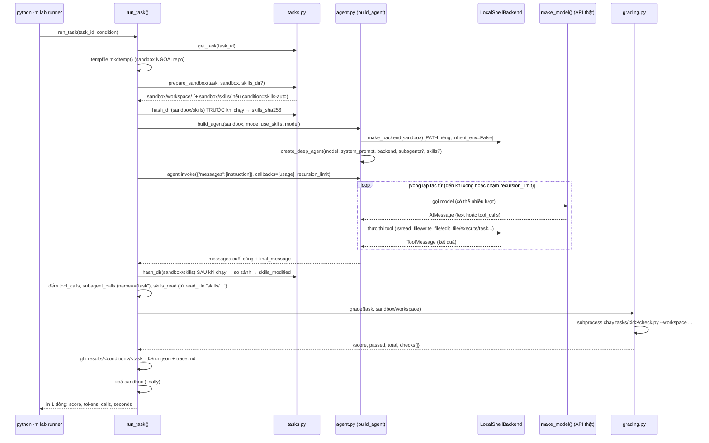
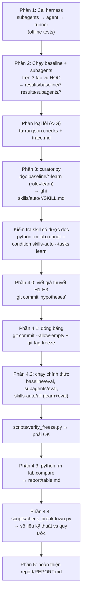

# Kiến trúc, luồng chạy và việc cần làm

Tài liệu này tổng hợp lại (từ `README.md`, `GUIDE.md`, `RUBRIC.md`, `GLOSSARY.md`, pseudo-code và mã nguồn hiện tại) để trả lời 3 câu hỏi: hệ thống gồm những file nào và vai trò gì, nó chạy theo luồng nào lúc thực thi, và bạn còn phải code/làm gì để hoàn thành lab. Không thay thế `GUIDE.md` — chỉ là bản đồ để tra nhanh.

**Trạng thái hiện tại của repo (đã kiểm tra):** `src/lab/agent.py`, `subagents.py`, `runner.py`, `curator.py` còn nguyên `NotImplementedError` ở mọi hàm TODO. `skills/auto/` chỉ có `README.md` (chưa có skill nào). `results/` rỗng. Chưa có commit `hypotheses`, chưa có tag `freeze`. `tests/test_01_provided.py` đã chạy được (15 passed) sau khi tạo `.venv` đúng cách và `pip install -e .`.

---

## 1. Kiến trúc file — ai làm gì

### 1.1 Sơ đồ phụ thuộc giữa các module

```mermaid
flowchart TB
    subgraph provided["CÓ SẴN — không sửa"]
        model["model.py<br/>make_model()"]
        tasksmod["tasks.py<br/>Task, get_task, list_tasks,<br/>prepare_sandbox, hash_dir, eval_markers"]
        grading["grading.py<br/>grade(task, workspace)"]
        testing["testing.py<br/>ScriptedChatModel (mô hình giả)"]
        compare["compare.py<br/>load_runs, build_table"]
    end

    subgraph todo["BẠN CÀI ĐẶT — 4 file, chỉ các hàm TODO"]
        subagents["subagents.py<br/>get_subagents()"]
        agent["agent.py<br/>make_backend()<br/>build_agent()"]
        runner["runner.py<br/>run_task()<br/>(main() có sẵn)"]
        curator["curator.py<br/>curate_skills()<br/>(validate_skill, parse_skill_blocks có sẵn)"]
    end

    subagents --> agent
    agent --> runner
    model --> agent
    tasksmod --> runner
    grading --> runner
    runner --> curator
    tasksmod -.eval_markers.-> curator
    runner -.run.json/trace.md.-> compare
    testing -.dùng trong tests/.-> agent
    testing -.dùng trong tests/.-> runner
```

**Thứ tự bắt buộc phải cài:** `subagents.py` → `agent.py` → `runner.py` → `curator.py` (vì `build_agent` gọi `get_subagents()`, và `curate_skills` đọc kết quả do `run_task` ghi ra).

### 1.2 Vai trò từng file

| File | Trạng thái | Hàm chính | Vai trò |
|---|---|---|---|
| `src/lab/model.py` | Có sẵn | `make_model()` | Đọc `.env` (`LAB_MODEL`, `LAB_BASE_URL`, `LAB_API_KEY`...), trả về chat model LangChain đã cấu hình. |
| `src/lab/tasks.py` | Có sẵn | `Task`, `get_task`, `list_tasks`, `prepare_sandbox`, `hash_dir`, `hash_skills`, `eval_markers` | Khám phá 6 tác vụ trong `tasks/`; dựng sandbox tạm (copy `workspace/` + `skills/`); băm thư mục để phát hiện thay đổi; tính danh sách định danh riêng của tác vụ đánh giá (để chặn rò rỉ). |
| `src/lab/grading.py` | Có sẵn | `grade(task, workspace)` | Chạy `tasks/<id>/check.py` trên workspace đã bị tác tử sửa, trả điểm/`checks`/`detail`. Tự xoá `detail` của check đạt và của mọi check tác vụ **đánh giá** (chống rò rỉ đáp án). |
| `src/lab/testing.py` | Có sẵn | `ScriptedChatModel` | Mô hình giả để test ngoại tuyến (không gọi API, không tốn token); ghi lại tool nào được bind, system prompt nào được gửi. |
| `src/lab/compare.py` | Có sẵn | `load_runs`, `build_table` | Đọc mọi `results/<condition>/<task>/run.json`, dựng bảng Markdown so sánh 3 điều kiện × 6 tác vụ + các hàng tổng hợp. |
| `src/lab/subagents.py` | **TODO** | `get_subagents()` | Khai báo ≥ 2 subagent (tên, `description`, `system_prompt`) để tác tử chính giao việc qua công cụ `task`. |
| `src/lab/agent.py` | **TODO** | `make_backend(sandbox)`, `build_agent(sandbox, mode, use_skills, model)` | `make_backend`: dựng `LocalShellBackend` (PATH riêng, không kế thừa env, root = sandbox). `build_agent`: gọi `create_deep_agent(...)` với `system_prompt`, `backend`, và tuỳ `mode`/`use_skills` thêm `subagents=` / `skills=["/skills/"]`. |
| `src/lab/runner.py` | **TODO 1 hàm** | `run_task(task_id, condition, ...)` (có sẵn `main`, `render_trace`, hằng `CONDITIONS`) | Dựng sandbox → build agent → `agent.invoke(...)` có callback đo token → đếm `tool_calls`/`subagent_calls`/`skills_read` → `grade(...)` → ghi `run.json` + `trace.md` → xoá sandbox. |
| `src/lab/curator.py` | **TODO 1 hàm** | `curate_skills(...)` (có sẵn `validate_skill`, `parse_skill_blocks`) | Đọc các `run.json`/`trace.md` của tác vụ **học** ở điều kiện `baseline`, gọi LLM một lần để sinh skill, lọc skill hợp lệ, ghi vào `skills/auto/<name>/SKILL.md`. |

### 1.3 Dữ liệu tĩnh (không phải code, không sửa)

| Thư mục/file | Nội dung |
|---|---|
| `tasks/<id>/` (6 cái: `code-learn`, `code-eval`, `data-learn`, `data-eval`, `logs-learn`, `logs-eval`) | `instruction.md` (đề bài), `workspace/` (dữ liệu/mã gốc để copy vào sandbox), `check.py` (bộ chấm tự động, ẩn danh với tác tử). |
| `guides/pseudocode/0{1..5}_*.md` | Pseudo-code chi tiết cho từng file bạn phải cài, theo đúng thứ tự `GUIDE.md` Phần 1 và 3. |
| `tests/test_0{1..4}_*.py` | Test ngoại tuyến (dùng `ScriptedChatModel`, không tốn token) — tiêu chí chấm điểm tự động (`RUBRIC.md` hạng mục 1, 30 điểm). |
| `scripts/tour.py`, `verify_freeze.py`, `check_breakdown.py` | Công cụ hỗ trợ (xem công cụ mặc định; kiểm tra quy trình đóng băng skill; thống kê check kỹ thuật vs quy ước). |
| `skills/auto/` | Nơi `curator.py` ghi skill tự sinh — **không được sửa tay**. |
| `results/` | Nơi `run_task` ghi `run.json` + `trace.md` cho mỗi `(condition, task)`. |
| `report/REPORT.md`, `report/table.md` | Báo cáo của bạn (REPORT.md copy từ `REPORT_TEMPLATE.md`; table.md do `lab.compare` sinh). |

---

## 2. Luồng chạy của hệ thống (runtime workflow)

### 2.1 Một lần chạy `run_task` (đơn vị nhỏ nhất)



Điểm mấu chốt cần nhớ khi code và khi đọc kết quả:

- **Sandbox là thư mục tạm, ngoài repo**, bị xoá sau mỗi lần chạy → `tasks/*/workspace` gốc không bao giờ bị sửa.
- **Đường dẫn luôn tương đối** (`workspace/...`, `skills/...`) — dùng được cả ở công cụ tệp (virtual path, root = sandbox) và ở shell thật (`execute`, cwd = sandbox). Dạng `/workspace/...` chỉ chạy được ở công cụ tệp, **không** chạy được trong `execute`.
- **Token được đo bằng `UsageMetadataCallbackHandler`**, cộng dồn cả lượt gọi của subagent (vì callback nằm ở tầng LangChain, không phải tầng message của luồng chính).
- **`trace.md` chỉ chứa luồng chính** của tác tử cha — việc subagent làm bên trong không hiện ra, chỉ thấy lệnh gọi `task` (đi) và báo cáo cuối (về).
- **`grade()` chạy `check.py` bằng subprocess**, tách biệt hoàn toàn với tác tử — tác tử không thể đọc được `check.py` để "biết đáp án" trừ khi nó cố tình mở (đây là một phần phân tích ở Phần 2.2 "nhóm lỗi E/F").

### 2.2 Luồng tổng thể của cả thí nghiệm (các phần trong GUIDE.md)



3 **điều kiện (condition)** luôn chạy trên cùng 6 tác vụ, khác nhau ở cách `build_agent` được gọi (xem `CONDITIONS` trong `runner.py`):

| Điều kiện | `mode` | `skills_dir` | Ý nghĩa |
|---|---|---|---|
| `baseline` | `single` | `None` | Tác tử Deep Agents mặc định (chỉ có subagent `general-purpose` sẵn có), không skill. |
| `subagents` | `subagents` | `None` | Thêm subagent tự định nghĩa (`get_subagents()`), không skill. |
| `skills-auto` | `single` | `"skills/auto"` | Tác tử mặc định nhưng được nạp skill do `curator` tự sinh. |

---

## 3. Việc bạn cần làm — checklist theo GUIDE.md

> Lệnh chạy ở gốc repo, venv đã activate: `cd /home/oabga/lab_vin20k/K4-DAY20-MULTIAGENTS-LeGiaBao-02887 && source .venv/bin/activate`

### Phần 0 — Cài đặt & làm quen (đã xong phần cài đặt)

- [x] `.venv` + `pip install -e .` (đã làm ở lượt trước, `pytest tests/test_01_provided.py` → 15 passed).
- [ ] Điền `.env` với **API key của bạn** (`LAB_MODEL=...` + biến khóa tương ứng, hoặc `LAB_BASE_URL`/`LAB_API_KEY`). Kiểm tra: `python -c "from lab.model import make_model; print(make_model().invoke('Reply with OK').content)"`.
- [ ] `python scripts/tour.py` (không tốn token) → trả lời 3 câu hỏi vào **mục 3 của `report/REPORT.md`** (công cụ mặc định; mô tả `task`/subagent `general-purpose`; 1 câu từ mô tả `task` + 1 câu từ mô tả `execute`).

### Phần 1 — Cài harness (bắt buộc đúng thứ tự)

| Bước | File | Việc cần code | Tham khảo | Lệnh kiểm tra |
|---|---|---|---|---|
| 1.1 | `src/lab/subagents.py` | Viết `get_subagents()`: trả list ≥2 dict `{name, description, system_prompt}` — gợi ý vai trò `explorer` / `implementer` / `reviewer`. `description` phải là **chỉ dẫn hành động** (khi nào gọi), không phải mô tả chung. | `guides/pseudocode/02_subagents.md` | `pytest tests/test_02_agent.py -k subagents` |
| 1.2 | `src/lab/agent.py` | `make_backend(sandbox)`: `LocalShellBackend(root_dir=sandbox, virtual_mode=True, inherit_env=False, env={"PATH":..., "HOME":str(sandbox), "PYTHONDONTWRITEBYTECODE":"1"}, timeout=120)` — PATH phải lấy từ `sys.executable` để tìm được `python`. `build_agent(...)`: validate `mode`, nối `PATHS_NOTE` vào `system_prompt` của mỗi subagent khi `mode=="subagents"` (+ `SUBAGENTS_NOTE` vào prompt chính), thêm `skills=["/skills/"]` + `SKILLS_NOTE` khi `use_skills`, rồi gọi `create_deep_agent(model=model or make_model(), system_prompt=prompt, backend=make_backend(sandbox), **kwargs)`. | `guides/pseudocode/01_agent.md` | `pytest tests/test_02_agent.py` |
| 1.3 | `src/lab/runner.py` | `run_task(...)`: xem chi tiết luồng ở mục 2.1 trên — sandbox tạm ngoài repo, `prepare_sandbox`, `hash_dir` trước/sau, `agent.invoke` với `UsageMetadataCallbackHandler` + `recursion_limit`, đếm `tool_calls`/`subagent_calls`/`skills_read`, `grade(...)`, ghi `run.json`+`trace.md`, **không ném lỗi ra ngoài** (bắt exception, ghi vào `error`), **luôn xoá sandbox** (dùng `try/finally`). | `guides/pseudocode/03_runner.md` | `pytest tests/test_03_runner.py` |

Sau khi `test_02` và `test_03` đạt toàn bộ, chạy xác nhận thật (**tốn token**, tính luôn vào baseline của `data-learn`, không cần chạy lại ở Phần 2):

```bash
python -m lab.runner --condition baseline --tasks data-learn
```

Kiểm tra `results/baseline/data-learn/run.json` và `trace.md` tồn tại, `tokens.total > 0`.

### Phần 2 — Chạy tác vụ học + phân loại lỗi

```bash
python -m lab.runner --condition baseline --tasks code-learn logs-learn
python -m lab.runner --condition subagents --tasks learn
```

- [ ] Mở `run.json`/`trace.md` của 3 tác vụ học (`code-learn`, `data-learn`, `logs-learn`) ở `baseline`, phân loại **mỗi check thất bại** vào nhóm A–G (xem bảng trong `GUIDE.md` Phần 2.2) kèm **bằng chứng cụ thể** (tên tác vụ, tên check, trích `detail`/vết) → mục 4 của `REPORT.md`. Cần ≥ 4 check thất bại được phân loại để đạt điểm cao (`RUBRIC.md` 2.2).
- [ ] Nếu đa số lỗi rơi vào nhóm E (quy ước tổ chức), dùng `scripts/check_breakdown.py` làm **bằng chứng phủ định** cho các nhóm A–D (tức là các check kỹ thuật vẫn đạt tốt).
- [ ] Đọc `run.json`/`trace.md` của `subagents`: có `subagent_calls` không, giao việc có đủ quy tắc không, so `tokens.total` với `baseline` → mục 5 của `REPORT.md`. (`subagent_calls == 0` vẫn là kết quả hợp lệ nếu được giải thích.)

### Phần 3 — Self-evolving (curator)

| File | Việc cần code | Tham khảo | Lệnh kiểm tra |
|---|---|---|---|
| `src/lab/curator.py` | `curate_skills(...)`: đọc `results/baseline/*/run.json` có `role=="learn"`, lấy check thất bại (`name`, `detail`) + ~6000 ký tự cuối của `trace.md`; nếu không có check thất bại nào → in cảnh báo, trả `[]`, **không gọi model**; nếu có → dựng prompt (mẫu có sẵn trong pseudocode), gọi `model.invoke(prompt)`, `parse_skill_blocks(reply)`, lọc bằng `validate_skill(text, expected_name=name)`, ghi tối đa `max_skills` skill hợp lệ vào `out_dir/<name>/SKILL.md`. **Tuyệt đối không đưa `role=="eval"` vào prompt.** | `guides/pseudocode/04_curator.md` | `pytest tests/test_04_curator.py` |

```bash
python -m lab.curator
python -m lab.runner --condition skills-auto --tasks learn
```

- [ ] Với mỗi skill sinh ra trong `skills/auto/`, trả lời 3 câu hỏi theo `guides/pseudocode/05_skill_quality.md` (tổng quát? đúng/sai? dài bao nhiêu dòng, `description` có nêu đúng tình huống kích hoạt?) → mục 6 của `REPORT.md`. **Không sửa tay nội dung skill** — chỉ được xoá skill kém/có hại và chạy lại curator (tối đa 2 lần), ghi lý do.
- [ ] Đối chiếu `skills_read` trong `run.json` với `trace.md`: skill có được đọc và làm theo từng quy tắc không, so với `baseline` cùng tác vụ.

### Phần 4 — Giả thuyết, đóng băng, chạy chính thức

```bash
# 4.0 viết H1-H3 vào mục 2 của report/REPORT.md TRƯỚC khi thấy điểm tác vụ đánh giá, rồi:
git add -A && git commit -m "hypotheses"

# 4.1 đóng băng skill — từ đây KHÔNG sửa skills/auto/
git add -A && git commit --allow-empty -m "freeze skills" && git tag freeze

# 4.2 chạy chính thức
python -m lab.runner --condition baseline --tasks eval
python -m lab.runner --condition subagents --tasks eval
mv results/skills-auto results/skills-auto-dev   # sao lưu kết quả Phần 3.4 trước khi ghi đè
python -m lab.runner --condition skills-auto --tasks all

python scripts/verify_freeze.py   # phải in OK
```

- [ ] `verify_freeze.py` báo lỗi nào thì sửa ngay lỗi đó (thường là thiếu commit `hypotheses` trước tag, hoặc skill bị đổi sau `freeze`).

```bash
# 4.3 bảng so sánh
python -m lab.compare > report/table.md

# 4.4 thống kê hỗ trợ
python scripts/check_breakdown.py
```

### Phần 5 — Báo cáo

- [ ] Hoàn thiện `report/REPORT.md` (mục 1–7 có thể viết trong buổi học; mục 8–10 sau buổi học): dán `report/table.md` vào mục 7; phân tích có số liệu ở mục 8 (so sánh học vs đánh giá, check kỹ thuật vs quy ước `rule_`, giải thích bằng `skills_read`/`trace.md`, chi phí token, quá khớp/rò rỉ); hạn chế thí nghiệm ở mục 9.

### Phần 6 — Thử thách mở rộng (tuỳ chọn, +5 điểm, chọn 1 trong 5 hướng 6a–6e trong `GUIDE.md`)

Chỉ làm sau khi Phần 1–5 đã xong và đạt điểm đầy đủ (điểm thưởng chỉ tính khi hạng mục 1–6 chính đã hoàn thành).

---

## 4. Những điều **không được làm** (trừ điểm nặng, theo `RUBRIC.md`)

- Không sửa `tests/`, `tasks/`, `scripts/`, hoặc các hàm/hằng đã đánh dấu "CÓ SẴN, KHÔNG SỬA" trong `model.py`, `tasks.py`, `grading.py`, `testing.py`, `compare.py`, `agent.py` (4 hằng prompt), `runner.py` (`render_trace`, `main`), `curator.py` (`validate_skill`, `parse_skill_blocks`) — giảng viên chạy test trên bản gốc của các tệp này.
- Không sửa tay nội dung `skills/auto/*/SKILL.md` — chỉ xoá nguyên thư mục skill và chạy lại `curator`.
- Không đưa dữ liệu/định danh của tác vụ **đánh giá** vào prompt của curator hay vào skill (đã có `eval_markers()` + `validate_skill` chặn tự động, nhưng tránh mở `tasks/*-eval/check.py` trước khi đóng băng).
- Không commit `.env` (đã có trong `.gitignore`) — lộ khoá API trừ 10 điểm.
- Không chạy song song nhiều lệnh gọi mô hình cùng lúc nếu gặp lỗi 429 (giới hạn tốc độ) — chạy tuần tự.
